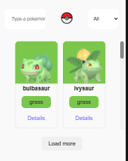
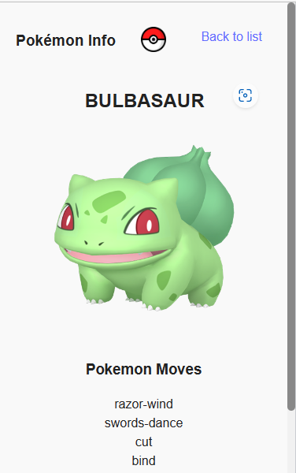
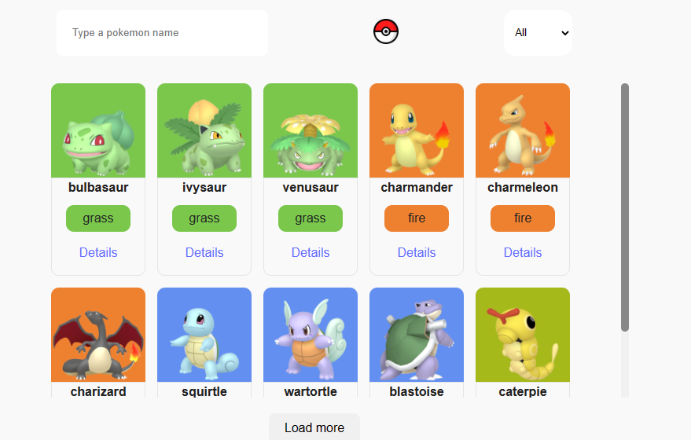
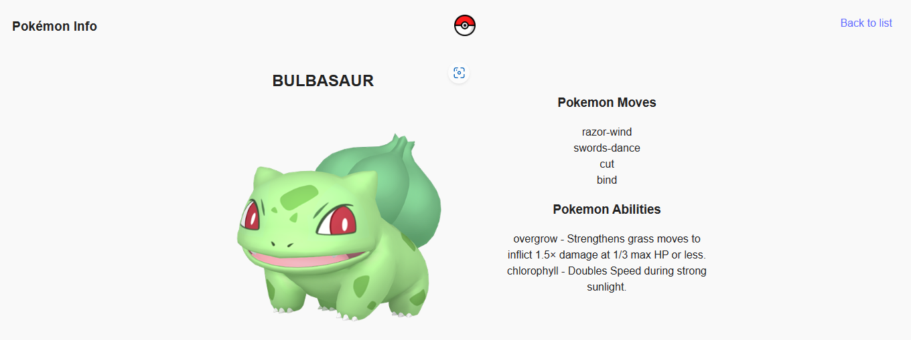

# Pokedex Typescript

Esse projeto foi inspirado na desafio avançado de React do curso DevQuest do DevEmDobro, originalmente sem o Typescript.

# Tecnologias e Libs usadas

- React
- TypeScript
- Vite
- React Router
- Styled Components
- Context API

# Features

- Pesquisa de Pokémons por nome
- Select com o tipo do Pokémon
- Página individual de cada um, contendo suas informações básicas.
- Um botão que permite a troca de tema usando o Context API. 

# Design
Não me apeguei muito ao design, tentei realizar a forma mais simples e funcional possível.

## Mobile

## Desktop

